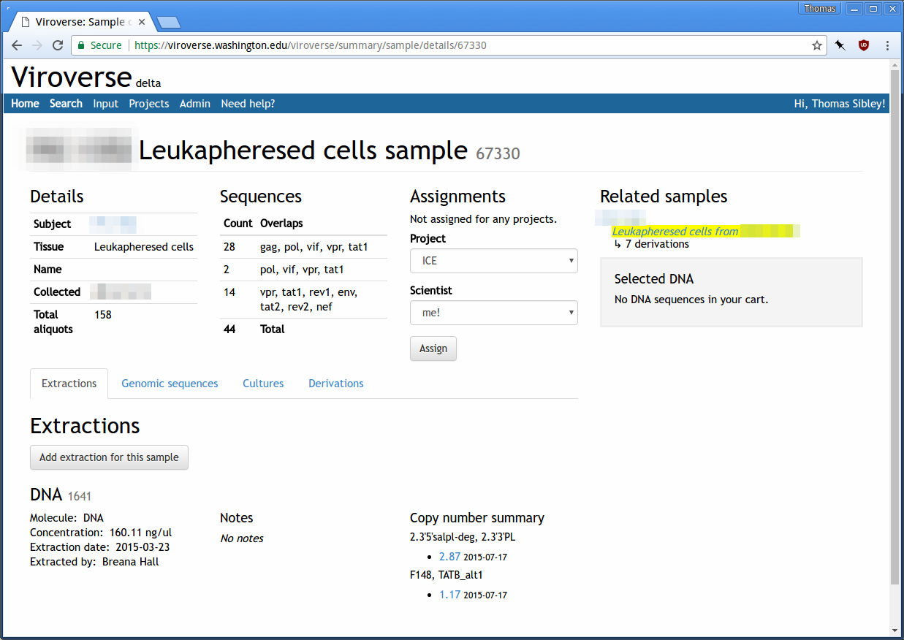

### Last mile software development

Writing modern software for bench scientists

🙛 🙙  <!-- .element: class="fleuron" -->

Thomas Sibley

<small>
[The Perl Conference 2017](http://www.perlconference.us/tpc-2017-dc/)  
Alexandria, VA
</small>

Notes:

Hello!  My name is Thomas Sibley.  I'm here today to talk about modern software
development in a biology research lab.

---

### [Mullins Molecular Retrovirology Lab](https://mullinslab.microbiol.washington.edu/)

[University of Washington](https://uw.edu)

Notes:

I work in the Mullins Molecular Retrovirology Lab at the University of
Washington in Seattle.

---

<figure>
 <!-- .element: class="frameless" width="850px" -->
<figcaption>Wikipedia, Thomas Splettstoesser</figcaption>
</figure>

Notes:

Molecular retrovirology means we look at viruses with RNA genomes and the
interaction of these viruses with molecules in the cell.  We approach questions
about the evolution of viruses and their interactions with human cells using a
variety of wet lab techniques at the lab bench and "dry lab" bioinformatics
techniques at the computer.  Each informs the other, and often exploration of
questions ping pongs back and forth between the two.

---


Notes:

My responsibilities cover everything involving a computer in the lab, from
analyzing data to writing new apps to managing our racks of hardware.  I've
been in the lab for going on four years now and have helped modernize existing
applications and kick off new ones.

---

 <!-- .element: class="frameless" -->

Notes:

You've probably heard horror stories about the kind of spaghetti, write-only
code that academic research produces, or even worse, maybe you've looked at the
BioPerl source code.

Ok, that's a cheap shot, but I'm here to tell you that not all software in
science is terrible!

---

### Act I: The Last Mile
### Act II: Improving the Situation
### Act III: Is this for you?

<!-- .slide: class="headers-left" -->

Notes:

This will be a talk in three acts.

In the first act, I'll explore this idea of the last mile as I think it applies
to software in science.

In the second act, I'll talk about the kind of work I do in the lab and show
examples of improvements we've made to the computing practices, viewed through
the lens of lessons learned.

In the final act, I'll talk about why you too might want to work in a science
lab.

---

### Act I

🙛 🙙  <!-- .element: class="fleuron snug" -->

## The Last Mile

Notes:

Let's get started.

---


<!-- .element: class="wide padded" -->

Notes:

The Mullins Lab has been around for 23 years at UW and for 12 years before that
at Stanford and Harvard.  That's a lot of time to generate data!  Some of the
lab's ongoing projects span decades, with new data being collected from the
start up until now.

This plot shows the collection dates of samples that the lab manages and works
with.

---

<figure>

<figcaption>Evan Silberman</figcaption>
</figure>

Notes:

The success of those projects is directly related to the lab's ability to make
sense of the data over time and not lose it to the frequent turnover of
students and postdocs or misplace it amidst shelves of lab notebooks.

Lab notebooks are an indispensible tool, but they don't scale.

---

 <!-- .element: class="frameless" -->

Notes:

Helping the lab make sense of data over the longer term and preserve it for
future study is an in-house informatics application called Viroverse.

This is a quick example of a detail page for a sample in the Viroverse system.

Bit rot is a real concern though, and having the data doesn't matter if the
software for accessing it doesn't work well.

---

 <!-- .element: class="frameless wide" -->

```
commit 47eca7460a6391be0bc532ab70e040736379439a
Author: ████████████ <██████@uw.edu>
Date:   Tue Oct 20 23:23:21 2009 +0000

    synchronize Mercurial and CVS repositories

159 files changed, 14093 insertions(+), 1416 deletions(-)
```

Notes:

When I first started, Viroverse didn't look like the previous picture.  It used
cobbled together YUI2 components everywhere, was running on mod\_perl, and
using not just a homemade ORM but also Class::DBI _and_ DBIx::Class.  It was
version controlled in an unholy combination of centralized CVS and private
Mercurial repositories.

---

```
commit 2a7d6c4bdab7993e0f1d3ac792545ba05b9e406c
Author: █████████ <███████@uw.edu>
Date:   Fri Nov 12 22:13:46 2010 +0000

    (no message)

41 files changed, 3015 insertions(+), 377 deletions(-)
```

# 🤔  <!-- .element: class="emoji" -->

Notes:

Over about a decade, various individuals had made their mark on the
application.  After a while you could pretty much tell who wrote what by how
the code looked and how well it functioned.

Most of the people in my position before me had come to the job with a
background primarily in biology not software.  The development practices that
had been used were _years_ behind current best practices.  Coming from an
open-source and commercial software background, I saw many opportunities for
modernization.  It was clear that many improvements in the field, from better
development tools to design practices to error handling to user experience,
simply hadn't reached the lab.

I don't attribute this to a lack of caring on the part of the folks before me.
Rather, I think for reasons ranging from the obtuseness of modern software
stacks to the traditional funding structures in biology, that the advances in
software and computing just hadn't _reached them yet_.

---

<figure>
 <!-- .element: class="frameless" -->
<figcaption>Wikipedia, Dycedarg</figcaption>
</figure>

Notes:

There's this idea in telecommunications that's been applied more generally to
providing any good or service: covering the "last mile" of distance, i.e. to
someone's home, is much harder than providing coverage up to that point.  It's
this "last mile" that necessitates your distribution network (physical or
virtual) leaf out immensely, seemingly immeasurably compared to more
concentrated service delivery points.

---

 <!-- .element: class="padded" -->

Notes:

Mail services are a good example.  Every day the US Postal Service touches,
often _literally_, every mailbox in America.  USPS would be a much smaller
business if it just had to get mail to regional distribution centers or even
local post offices.  The difficulty and expense of bridging that "last mile" is
the reason why private mail carriers like UPS and FedEx, as they handled more
and more packages with the rise of online shopping, started using USPS for
final delivery.  USPS already had a "last mile" network because it's a much
older organization that had the mandate to do so.

---

## People _do_ care

Notes:

When I first started in the lab, I thought terrible software was just par for
the course because no one cared as long as it appeared to work once.

I now see it as a last mile problem.  It's not that the field doesn't care
about producing bad, error-prone code that reinvents previously solved wheels,
but that the field doesn't have access to modern practices and technology when
it comes to software and, more broadly, computing.

---


Notes:

The tech industry is busy building gleaming, glistening towers up in the
clouds.  While it's busy "innovating" by putting software in everything from
toothbrushes to mugs, the industry doesn't seem to have much interest in
actually trying to advance other fields by bringing to them the bread and
butter tech we've all had for a while now, like snappy, reactive web apps.

---

> If you feed the horse enough oats, some will pass through to the road for the
> sparrows.
>
> —[John Kenneth Galbraith](http://www.nybooks.com/articles/1982/02/04/recession-economics/)

Notes:

I don't see many people who I think of as tech ambassadors, people who try to
keep one foot in tech and one foot in another field and facilitate knowledge
transfer.  It seems that everyone thinks tech will just trickle down
eventually.  An older name for trickle-down theory was horse-and-sparrow
theory.

The tech industry is easy to blame, but it's not all its fault of course.
Traditional funding structures in biology, for example, can make it hard to
competively hire professional developers.  Generational and institutional
biases often devalue staff roles in science, making it harder to justify
bringing in outside talent.  Neither of these are universal, but they are
impediments that are slowing breaking down.

---

### Act II

🙛 🙙  <!-- .element: class="fleuron snug" -->

## Improving the Situation

Notes:

While I can't affect funding structures, I _can_ help dispense with the myths
that all software in science has to be terrible and that the people writing it
have to be trained scientists!  Perhaps I can even pique your interest in
bringing professional software development to research science.

---


Notes:

From day one, my goal was to improve the situation I found.  I didn't know much
about biology at the time, but I knew what rotten software smelled like.  The
name of the game was to throw out what was rotten and keep what was sound, then
build from there.  Since I didn't have a big picture of what the lab needed, I
hoped that by relentlessly improving the computing environment I would find
ways to help out everyone.

---

```
# primerMatrix's tip is a commit which doesn't belong in time or
# topology; make a new branch and correct the primerMatrix branch
cd $(GIT); \
	git branch -m primerMatrix assembly-in-memory; \
	git branch primerMatrix assembly-in-memory~; \
	git rebase \
		--committer-date-is-author-date \
		--onto `git merge-base master assembly-in-memory` \
		primerMatrix assembly-in-memory; \
	git checkout master
cd $(GIT); \
	ATTIC_FIXUP_START=`git log --format=%H --diff-filter=D -- mvc/lib/Viroverse/Model/loadingfile.pm` \
	git filter-branch \
	--index-filter "bash $(PWD)/filter-fixup-attic $(PWD)/$(GIT) /tmp/do-attic-fixup" \
	--parent-filter "perl $(PWD)/filter-add-merge-parents" \
	--msg-filter "perl $(PWD)/filter-msg-cleanup" \
	--commit-filter '[[ -n `git rev-list $$GIT_COMMIT..start` ]] && skip_commit "$$@" || git commit-tree "$$@"' \
	--tag-name-filter cat \
	-- \
	--all \
		&& git reset --hard master \
		&& git for-each-ref --format="%(refname)" refs/original/ \
			| xargs -n1 git update-ref -d \
		&& git reflog expire --expire=now --all \
		&& git gc --prune=now
```

Notes:

Progress was slow at first.  I spent about my first three weeks converting a
mess of a global cvs repository to the best git repository I could manage.

More weeks were spent improving the deployment infrastructure for Viroverse,
the lab's primary web application, so that I could deploy changes during
working hours without accidentally eating someone's data they were in the
middle of inputting.  Gradually, tangible improvements compounded and real
progress was easier to make.

A year later, the results were good enough to convince my boss, Jim, to let me
hire a coworker to work alongside me.  Since then, improvement's been much more
rampant and together we've been able to feasibly tackle larger projects.

---

## What Did We Learn?

Notes:

Over these past years, I've learned a lot about how a lab works and how science
works, and I want to share those lessons and examples with you.  These are
lessons I remind myself of and try to work by, because often my default
reaction is the opposite.  I think they give a nice glimpse into my day-to-day
role where I strive to make excellent software for scientists.  The first is...

---

## Enable people to use better practices

Notes:

Enable people to use better practices.  What I mean by this is that our work
should make it easier for people to use best practices rather than try to force
them to do so.

A while back we had an issue in lab around how sequences were named.
Scientists would generate sequences in the wet lab, attach mostly standardized
names, and upload them into our database, Viroverse.  But when it came time to
do the analysis, instead of downloading the sequences en masse from Viroverse,
people would collect all the data files from dozens of personal folders on
the shared file server.

This wasn't ideal because Viroverse was supposed to be the authority for our
sequencing data.  It was important to keep the assigned accession number
attached to sequences for data provenence, and sequences were also sometimes
revised in Viroverse without the data files on the file server being updated.

~~~

`XXWI30123780XXx990414XXpXXXX12873660`

Notes:

The problem was that it was hard to find and download all the sequences you
needed, and when you did, each sequence was assigned a name that, as far as
anyone was concerned, was just noise to them that got in the way during
analysis.

Names looked like this gibberish, which is an insane mix of fixed length fields
with some variable length fields thrown in the middle!

Since the sequences on the file server were more sanely named, people naturally
opted to use those instead.  Instead of trying to enforce a policy, we made it
easier to get sequences from Viroverse than to trawl the file server for them.
First, improved searching made it easier to get the batch of sequences you
needed.

~~~

 <!-- .element: class="wide" -->

Notes:

To replace a typically bad "advanced search" like this, which no one could use,
I built...

~~~

 <!-- .element: class="frameless" -->

Notes:

...a faceted search interface which updates immediately when you click a facet
value to start searching.  It's immediately graspable by playing around, and
you don't have to already know what kinds of values you can search for.
They're all just shown!  Faceted searching is one of those improvements that is
all over the tech world, but that I rarely see outside of it.

We're also using a slimmed down version of this same component to replace some
data tables since it works nicely as a general filter interface.

~~~


Notes:

Crucially, now that people could find the sequences more easily, the download
process also started letting you choose how you wanted the sequences named.

This widget is pretty simple, but it's intuitive and super useful.  You check
off the fields you want in your sequence names, you drag the fields around to
set the order within the name, change the delimiter if you want, and off you
go, with data tailored to your needs.

More people started fetching sequences from Viroverse, with the assigned ids
intact, and they didn't have to spend time renaming sequences themselves via
careful series of find-and-replace operations in TextWrangler.

---

## Don’t collect data you don’t plan to use

Notes:

Don't collect data you don't plan to use.

While it's tempting to collect as many details as possible in the hope that
it'll be useful someday, all it does in the short-term is add work for
everyone.  Bench scientists already keep detailed lab notebooks, so it's not as
if the data is gone forever if you do find you need it later.

It also turns out that if you ask scientists to enter information that they
know is never used, they won't bother to enter it accurately.  You might as
well just stop collecting it, which will be easier for everyone.

We ran into this with our sequence upload workflow.  Previously people were
required to tediously "paint" a diagram of how they were submitting their
samples to the sequencing facility.  This interface required repetitively
dragging over the diagram to specify up to dozens of values for each sample
sequenced.  After doing so, they still had to manually prepare the same
information in a different format for the sequencing facility.

When scientists eventually got back their sequencing results, they then had to
upload the several dozen files and manually drag-and-drop match them with the
correct location on their diagrams.  It was slow and error-prone and ultimately
collecting data that we didn't need.  The result was that people fabricated
their metadata diagrams in ways that made the data input steps easier, rather
than sticking to what they really did.

~~~


Notes:

In the end, we replaced that part of the input workflow with this batch upload
process incorporating heuristics for automatic data matching.

~~~


Notes:

After upload, all our scientists need to do now is review the automatic
matches, fix any mistakes, and click save.

People were so appreciative of this change because we _stopped wasting their
time_.

---

## Data is useless if not in front of someone’s eyes

Notes:

Data is useless unless it's in front of someone's eyeballs.  When I first
started, a lot of the data we had wasn't very visible to the lab.  I had access
to it, if I knew it existed, and could pull it up on demand, but the lab didn't
always know what data we had or have the ability to see it.

Invisible data doesn't inspire questions and generate hypotheses.  It doesn't
register as available or pertinent when planning analyses.  Probably about a
third of my overall job is thinking critically about how to best surface and
present the data we already have.

Scientists are naturally curious, and so if there's data in front of them,
they'll look at it and ask questions of it.  There are all sorts of good ways
to get data in front of people.

Many people dismiss data tables as boring and immediately reach for plots and
charts and diagrams, but I'd take a thoughtful, well-designed data table over a
poorly thought-out visualization any day.

There are all kinds of data tables, and they adapt nicely to different needs
and constraints.

~~~

 <!-- .element: class="frameless" -->

Notes:

You can start simple with a static but information-dense table for basic
scanning.  Sparklines are helpful for increasing information density in this
table, showing longitudinal data that otherwise wouldn't fit but is important
when skimming the table to find suitable study subjects.

~~~

 <!-- .element: class="frameless" -->

Notes:

From there you can add filtering and sorting by pertinent properties, and
graphical labels for easier scanning.

~~~

 <!-- .element: class="padded" -->

Notes:

As the data becomes more complex, you can present different views of the same
data with a toggle.

These buttons convert the units in the table because different units are easier
for some tasks than others.  The raw units are in total copies detected, but
it's often useful to know the frequency of detection relative to the
baseline.

~~~

 <!-- .element: class="frameless" -->

Notes:

Sometimes its nice to interactively link a table with a visualization so that
people can flip between the two as they dig into the data.  The previous table
and this plot of data are linked, so that selecting a curve in the plot selects
the related data in the table, and vice versa.

~~~


Notes:

When a data table becomes unwieldy, like this all-scrolling, all-dancing
horror, you can upgrade it directly to the visualization and regain
comprehension.

~~~


Notes:

This is what is replacing that table, not only increasing information density
but also clarity.  And no more horizontal scrolling!

~~~


Notes:

Simple plots are a dime-a-dozen in science, but good visualizations integrate
and synthesize lots of data in order to highlight relationships within and
between groups.

This viz compares the performance of the current experiment, highlighted, to
related experiments, and is used for quality control.

~~~


Notes:

Bad visualizations are hard to digest and leave you wondering who thought this
was a good idea.  They're like a pizza with too many toppings.

~~~

 <!-- .element: class="wide" -->

Notes:

Good visualizations present the same data with clarity.

---

## “Build just up to the edges”

Notes:

Designing and building research software is different than building a product
to your vision.  Research software must fit into the workflows that already
exist, by and large, outside of the computer and not dictate them.

You're modeling real-world steps that happen in experiments, things that
experiments produce, and actions that people perform.  You don't typically get
to decide what someone does at the bench, and so the challenges are different
from designing many software products or applications.

The software is in service to the science and scientific goals.  The job is to
save labor, not create it by imposing new demands.  My colleague Evan talks
about this goal as "building right up to the edges of what researchers are
already doing."

Sometimes I like to think of it as...

~~~

 <!-- .element: style="width: 750px" -->

Notes:

"I won't touch what already works for you"

~~~


Notes:

One of my concrete lessons in this was when building a data input widget for
counts of cells.

This widget mimics the layout of the device used under a microscope to count
alive and dead cells.  Each quadrant gets counted, and along with a volume and
known dilution, the number of cells in the entire dish can be extrapolated.

I talked with the scientists a lot about the process of counting cells, and the
steps and data involved.  There were mockups and sketches, and I designed the
widget with the data entry task in mind.  It supports a tally mode designed for
use with an external numpad where keypresses tally either live or dead cells
and move between the quadrants.  It's fully operable with one hand, and even
includes distinct audio feedback for the keys you've pressed so you know you
hit the right one.  They could directly enter this data while they were
collecting it!  I was pretty pleased with the result.

After all that thought and effort though, it was barely used as intended.  What
went wrong?  Well, see, the scientists are recording these counts while in a
biosafety level 3 lab space.  They're in gowns and hats, goggles, and are
wearing two gloves on each hand.  It's hot in the small, fully enclosed room.
Counting cells is mundane and tedious and a lot of microscope time, so they
streamline the process with two people: one preparing the cells to count and
the other counting.  Futzing with a laptop and software to do direct entry,
even with the UX affordances was simply a non-starter.  The goal is to get in
and get out as soon as possible.  It's much much faster to use a physical
clicker, like the kind at movie theatres, and just scribble down numbers on a
piece of paper as you go.  The paper is easily transcribed to a spreadsheet
when they're done, in the comfort of their offices.

~~~


Notes:

So what'd we do?  Well, we removed nearly all of the specialized functionality
for that widget, leaving just the bare bones input form for cases when a single
count needed to be added, and added a way to bulk upload counts from a
spreadsheet.  This met the scientists on their own terms, right up to the
edge of what they were already doing.

~~~

<figure>

<figcaption>Evan Silberman</figcaption>
</figure>

Notes:

Another good example of this when we realized our scientists were hand labeling
dozens of tiny stickers for every experiment they did.  Each sticker's label
had to be different, making even using a Word template laborious.

In this photo, each white dot is a sticker on top of a small vial.  That's not
a giant marker, the stickers are just _tiny_!

These aren't the normal printable stickers you'd buy at OfficeDepot either.
They're cryo-safe stickers which will stay stuck to vials for years at minus
200°C (-328°F) while they chill out in the liquid nitrogen freezer.

While our scientists just buckled down to get the job done every time, it was
obvious that we couldn't let that stand.

~~~

 <!-- .element: class="frameless" -->

Notes:

After only a couple days of hacking, testing, and discussing stickers, our
scientists can now come to the lab's tissue culture app, TCozy, and generate
labels based on the relevant data for the experiment they're wrapping up and
freezing down.

Once they no longer had to worry about actually labeling the stickers
themselves, they started suggesting improvements like color coding the label
text and creating a second sticker for each vial which contained additional
information.

~~~

<figure>

<figcaption>Evan Silberman</figcaption>
</figure>

Notes:

There's also this piece of paper in the background of the picture.  That's a
plate setup guide which our app produces to help the scientists figure out what
samples go where on 96-well plate.  It matches the instrument setup files that
our app also generates.  Taking a couple hours of our time to produce those
automatically is saving the scientists many hours of time in the long term and
meets their workflows where they already are.

---

## Learn to be comfortable adapting your models

Notes:

Research science moves rapidly, much more rapidly than most software
development can keep pace with, and especially so when the scientists are
likely to outnumber the developers.  Scientists will perform an experiment,
learn something from it, and rinse and repeat ad infinitum, tweaking not just
variables but also abandoning and adopting entire methods.  You can't model
every experiment.  You can't capture all the data.  You can't predict how the
data being produced will fundamentally change over time as the way it's
generated changes.

Software for bench scientists is so close to the physical world that no
simplified, abstracted model of that world survives for very long before
needing to be revised.

Because of this, I've learned to be comfortable making changes to our schemas,
to be comfortable changing our object models, and to always consider if the
problem will be easier by first adapting the model to fit the new reality.  All
software makes simplifications about the real world in order to make it
tractable and understandable.  Learn how to start simple and grow more nuanced
from there as the needs arise.

We've found some good tools and techniques to help cope with rapid schema
changes.

~~~

### App::Sqitch

David Wheeler (THEORY)

[sqitch.org](http://sqitch.org)

Notes:

We use David Wheeler's sqitch to manage schema changes for our projects.

It organizes your schema changes into sets of deploy, revert, and verify
scripts, with dependencies between your changesets declared in a plan file.
There's nice command-line tooling to manage changesets and apply them or roll
them back.  The best part is that things like view definitions can be reworked
in-place, leading to awesomely useful diffs in git.

It's pretty good, and I recommend it.

~~~

    commit c3c755140031e1e8b80ece9a3c9b9bed992d503c
    Author: ████████ <███████@uw.edu>
    Date:   Wed Feb 9 23:36:37 2011 +0000
    
		Moving in Freezer System Whoo Hooo
		
		Requires the following DDL:
		
		begin transaction;
		CREATE SCHEMA freezer
		
		-- DROP TABLE freezer.freezer;
		CREATE TABLE freezer.freezer
		(
		  freezer_id serial NOT NULL,
		  "name" character varying(255) NOT NULL,
		  owning_scientist_id integer,
		  creating_scientist_id integer,

Notes:

It's certainly better than putting your database migration scripts in your
commit messages.

~~~

## JSON document store…

Notes:

While sqitch is nice for bringing sanity to the process of making schema
changes, sometimes you need the flexibility to capture data before you can make
the schema changes.  Other times you want to capture data that's inherently
variable and annoyingly hard to model relationally.

A JSON document store is a great option for this, but we didn't want another
database service and we _did_ want the documents themselves to tied to
relational objects...

~~~

## JSON document store… in Postgres

Notes:

...so we use Postgres!  We've found it works really well, and results in a very
nice combination of flexibility without throwing out all relational integrity
or adopting a fully destructured object-key-value relational table.  It's easy
to start using and provides straightforward upgrade paths to proper relational
tables (managed with sqitch) once you're far enough along to know what's worth
refactoring into the relational model and what's not.

It's also fast!  The native JSON types in Pg are indexable and work well.  You
can even add CHECK constraints to do basic JSON document validation.  The
documents are manipulatable and traversable in SQL when you need it, which
makes ad-hoc queries easy.

~~~

```sql
CREATE VIEW tcozy.cell_counts AS
SELECT
    observation_id,
    exp.name                                          as experiment,
    exp.experiment_id                                 as experiment_id,
    tcp.name                                          as tc_plate,
    tcw.name                                          as tc_well,
    tpt.day                                           as tc_day,
    ( document#>>'{total,volume}' )::numeric          as volume,
    ( document#>>'{total,dilution_factor}' )::numeric as dilution_factor,
    ( document#>>'{viable,count}' )::numeric          as viable_cells,
    ( document#>>'{viable,density}' )::numeric        as viable_density,
    ( document#>>'{dead,count}' )::numeric            as dead_cells,
    ( document#>>'{dead,density}' )::numeric          as dead_density,
    ( document#>>'{total,count}' )::numeric           as total_cells,
    ( document#>>'{total,density}' )::numeric         as total_density,
    CASE WHEN (document#>>'{total,count}')::numeric != 0 THEN
        round((document#>>'{viable,count}')::numeric
            / (document#>>'{total,count}')::numeric
            * 100, 2)
    END                                               as viability,
    username                                          as performed_by
FROM observation
JOIN timepoint tpt                 USING (timepoint_id)
JOIN experiment exp                   ON (tpt.experiment_id = exp.experiment_id)
LEFT JOIN tissue_culture_well tcw     ON (observation.tissue_culture_well_id = tcw.tissue_culture_well_id)
LEFT JOIN tissue_culture_plate tcp    ON (COALESCE(tcw.tissue_culture_plate_id, observation.tissue_culture_plate_id) = tcp.tissue_culture_plate_id)
LEFT JOIN users                       ON (observation.performed_by_user_id = users.user_id)
WHERE document @> '{"type": "CellCounts"}';
```

Notes:

This also lets us create views designed for analysis that present the documents
as flat tables joined into relevant rows, meaning our data scientists don't
have to know about the document structure or JSON operators in SQL.

~~~

```perl
package TCozy::Document::CellCounts {
    extends 'TCozy::Document';

    has [qw[ viable dead total ]] => (
        is       => 'ro',
        isa      => Doc["CellCounts::Count"],
        coerce   => 1,
        required => 1,
    );

    has '+total' => (
        is => 'lazy',
    );

    sub _build_total {
        my $self = shift;
        return TCozy::Document::CellCounts::Count->new(
            ($self->viable->has_counts
                ? (counts => [
                    pairmap { $a + $b }
                        zip $self->viable->counts->@*,
                            $self->dead->counts->@* ])
                : (count => $self->viable->count + $self->dead->count)),
            volume => $self->viable->volume,
            dilution_factor => $self->viable->dilution_factor,
        );
    }
	…
```

Notes:

Our DBIx::Class models have helper methods for searching and filtering on the
JSON documents, and the document columns themselves are automatically inflated
to typed document classes so that we can constrain them on the application side
and work with them as first-class objects.

This approach also yields nice options for future schema upgrades when you
realize that perhaps some of the JSON data should be properly modeled.  Since
the data is already in the database, it's straightforward to write a migration
script (in sqitch of course) moving data out of JSON documents and into proper
relational tables.

We use JSON documents in Pg in two primary ways:

~~~

```
tcozy=> \d tcozy.experiment
                                   Table "tcozy.experiment"
    Column     │  Type   │                             Modifiers                              
───────────────┼─────────┼────────────────────────────────────────────────────────────────────
 experiment_id │ integer │ not null default nextval('experiment_experiment_id_seq'::regclass)
 name          │ text    │ 
 description   │ text    │ 
 metadata      │ jsonb   │ 
```

Notes:

1. As a column directly on a primary record, usually to hold variable metadata

~~~

```
tcozy=> \d tcozy.observation
                                        Table "tcozy.observation"
         Column          │  Type   │                              Modifiers                               
─────────────────────────┼─────────┼──────────────────────────────────────────────────────────────────────
 observation_id          │ integer │ not null default nextval('observation_observation_id_seq'::regclass)
 document                │ jsonb   │ not null
 performed_by_user_id    │ integer │ not null
 timepoint_id            │ integer │ 
 tissue_culture_plate_id │ integer │ 
 tissue_culture_well_id  │ integer │ 
 qpcr_plate_id           │ integer │ 
Indexes:
    "observation_pkey" PRIMARY KEY, btree (observation_id)
    "observation_document_idx" gin (document)
Check constraints:
    "observation_document_has_type" CHECK (document ? 'type'::text)
    "observation_has_one_object" CHECK (COALESCE(tissue_culture_plate_id, tissue_culture_well_id, qpcr_plate
```

Notes:

2. As an better object-key-value pattern, an object-document pattern if you
   will.  The document table refers to objects by real foreign keys, and can
   contain other metadata and relationships as necessary.

One tantalizing improvement to this approach that we may try in the future is
using our application document models to produce JSON Schemas and JSON Schemas
to produce database CHECK constraints so that we can validate docs regardless
of how they enter the database.

---

## Removing tedium makes space for new ideas and improvements

Notes:

And finally, I think the most exciting and important lesson I've learned during
my time in the lab is that when you remove the tedium from people's work, you
help make space for them to think up new ideas and improvements to their
workflows.

What's deemed reasonable, or even desireable, to do changes once tedious tasks
vanish and people can think more creatively about the bigger picture.

Many of us have likely encountered fundamental misunderstandings about what's
easy to make the computer do and what's hard.  Every visible, successful
example of automating away tedium is another example of how the computer can
work for someone and a closing of that gap of understanding.  They can better
relate the possibilities to their own tasks.  At first in lab I had to ask
around for direct ways I could help people on their own work, but over time,
people started approaching us to ask about making some process they were doing
faster or easier or less error-prone.

---

### Act III

🙛 🙙  <!-- .element: class="fleuron snug" -->

## Is this for you?

Notes:

So is this for you?

The field of biology has a dire need for people who can think computationally
and write good software at all levels.  The field is currently grappling with
how to build out these skills the last mile.

Currently demand vastly outstrips supply for computational skills in biology.
There's a general consensus that the field needs to, as a whole, incorporate
more bioinformatics and software development training into undergraduate and
graduate biology curriculums.  While this certainly must happen to a degree,
it's a little like saying, "Well, to be a successful mechanical engineer, you
now also need a law degree."  The disciplines and practices of bioinformatics
and software development are vast!  While familiarity and literacy in both is a
good goal, it's unreasonable to expect biology students to start mastering
multiple fields.

There's another strategy that I think should be part of the solution, that's
starting to come around in the field: create staff positions for and recruit
professional software developers into research science.  There are interesting
and meaningful problems to solve in biology and a different culture than the
tech industry, both of which can be attractive selling points.

~~~

* Learning new domains is fun
* Lots of room to operate in
* Fast pace

Notes:

The rewards of working in a lab are many:

• You'll learn a new domain; scientists are happy to teach and explain.

• You'll be doing scientific research, where the problems are different than
  you're used to.  There's broad space for your own thoughts, decision making,
  implementation, and feedback.

• The pace is often fast and exciting.  You can never keep up with bench
  scientists, whether they're working on a new assay or churning through a rote
  set of experiments, thinking on your feet is necessary.  You'll build
  "minimum viable products" to start capturing data now and then refine it to
  allow ongoing analysis.

~~~

<figure>

<figcaption><a href="https://xkcd.com/208/">xkcd</a></figcaption>
</figure>

Notes:

As programmers who know Perl, you're well-poised to think in terms of both
high-level applications and raw data manipulation.  You'll be able to deploy
regular expressions to save the day.

~~~

## Compassionate computing

Notes:

You don't need a PhD to do this work, but you do need to have empathy and a
determination to help others.  I like to think of it as "compassionate
computing", or software for humans.

---

## Thanks!

Evan Silberman

Jim Mullins

🙛 🙙  <!-- .element: class="fleuron snug" -->

[@trs](https://twitter.com/trs)  
<small>[tsibley.net/talks/last-mile-software-development/](https://tsibley.net/talks/last-mile-software-development/)</small>


Notes:

That's all!  I'd like to thank Evan Silberman, for his thoughts and
conversations about these topics while we work, and Jim Mullins, for his
support and allowing me wide discretion in the lab.

And thank _you_ for your attention!  I'll take questions now.
